<div align="center">

# 🔥 Forecast — Climate Hazard Trend Analyzer

**Detect and diagnose climate hazard trends worldwide, with honest statistics.**

ERA5 reanalysis · Percentile-based hazard detection · Mann-Kendall + OLS trend tests · Dark & light themes

[🌐 Live Demo](#-links) · [🎥 Demo Video](#-links) · [🏗 Architecture](#-system-architecture) · [🔬 Hazard Logic](#-hazard-detection-logic) · [🤖 AI Tools Used](#-ai-tools-used)

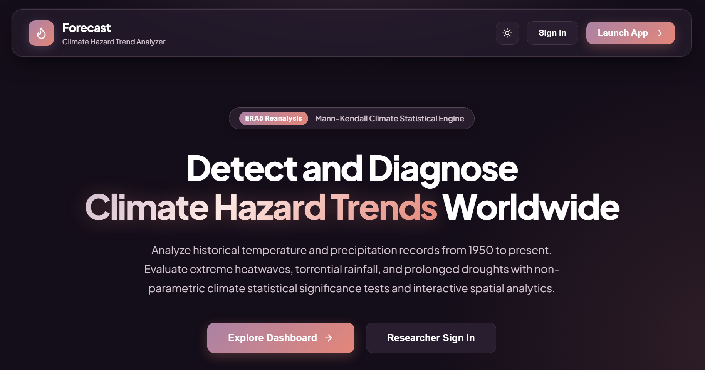

</div>

---

## 📑 Table of Contents

1. [Overview](#-overview)
2. [Links](#-links)
3. [Features](#-features)
4. [Screenshots](#-screenshots)
5. [Design-First Approach](#-design-first-approach)
6. [System Architecture](#-system-architecture)
7. [Low-Level Design](#-low-level-design)
8. [UML Diagrams](#-uml-diagrams)
9. [Data Sources & Data Handling](#-data-sources--data-handling)
10. [Hazard Detection Logic](#-hazard-detection-logic)
11. [Trend Analysis & Honest Insights](#-trend-analysis--honest-insights)
12. [Security & Performance](#-security--performance)
13. [Tech Stack](#-tech-stack)
14. [Setup Instructions](#-setup-instructions)
15. [API Reference](#-api-reference)
16. [Project Structure](#-project-structure)
17. [Assumptions](#-assumptions)
18. [Known Limitations](#-known-limitations)
19. [What I Would Improve With More Time](#-what-i-would-improve-with-more-time)
20. [AI Tools Used](#-ai-tools-used)

---

## 🌍 Overview

Forecast is a full-stack web application that analyzes historical temperature and precipitation records (1950 → present) for any location on Earth and answers one question rigorously:

> **Is this climate hazard getting worse here, and is that change statistically meaningful, or just noise?**

Users pick a region, choose a hazard (**Heatwave** by default, plus Rainfall and Drought), tune the detection thresholds and a time range, and receive:

- an automatically detected **catalog of hazard events**,
- **interactive time-series charts** of frequency, duration and intensity,
- a **statistical diagnosis** (Mann-Kendall + OLS) written in plain English, which reports *"statistical uncertainty"* when the data does not support a claim.

---

## 🔗 Links

| Item | Link |
|---|---|
| Live app | `https://<your-deployed-url>` |
| Demo video (3–5 min) | `https://<your-loom-or-drive-link>` |
| Demo access | Click **Quick Demo Login (Evaluator Access)** on the sign-in page, no signup needed |

---

## ✨ Features

| Area | What you get |
|---|---|
| **Region selection** | Preset climate hotspots · global city/state search · manual latitude/longitude · interactive **Leaflet** map picker (click to relocate) |
| **Hazard indicators** | 🔥 **Heatwave (default)** · 🌧 Rainfall · ☀ Drought |
| **Configurable parameters** | Start/end year · threshold percentile (80th frequent → 95th standard → 99th severe) · minimum consecutive days (default 3, WMO-aligned) |
| **Statistical diagnosis** | Mann-Kendall Z & p-value · OLS slope (events/decade) and R² · period-over-period shift · auto-generated verdict banner |
| **KPI cards** | Total detected events · period-over-period shift · rate of change (OLS) · threshold baseline |
| **Interactive charts** | Annual Frequency (bars + 5-yr rolling average + OLS trendline) · Hazard Duration · Peak Severity, all with tooltips |
| **Event log** | Paginated chronological catalog: start/end, duration, peak temp, mean temp, excess degree-days |
| **Export (bonus)** | Raw events **CSV** and printable **PDF** executive summary |
| **Auth** | Researcher sign-in / sign-up + 1-click evaluator demo login |
| **Theming** | Full **dark** and **light** themes with a one-click toggle |

---

## 🖼 Screenshots

### Landing page

| Dark | Light |
|---|---|
|  | 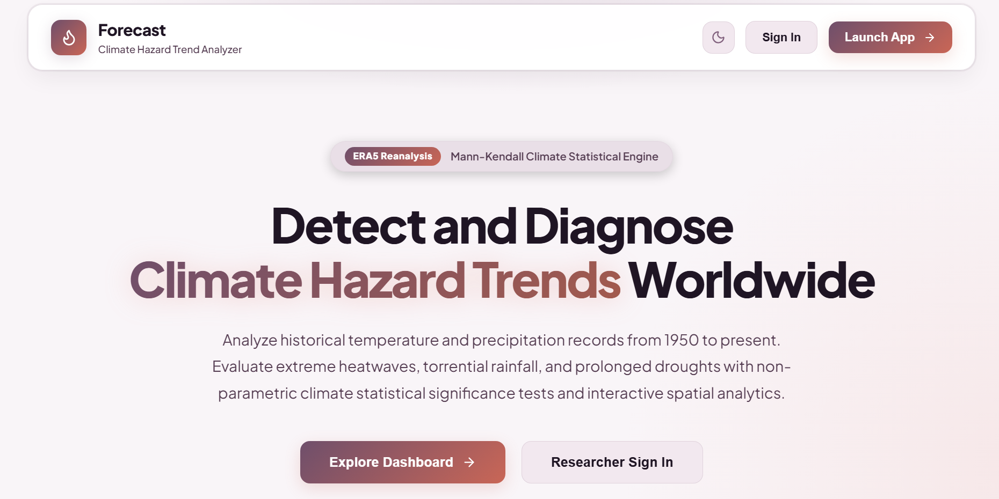 |

### Authentication

| Dark | Light |
|---|---|
| 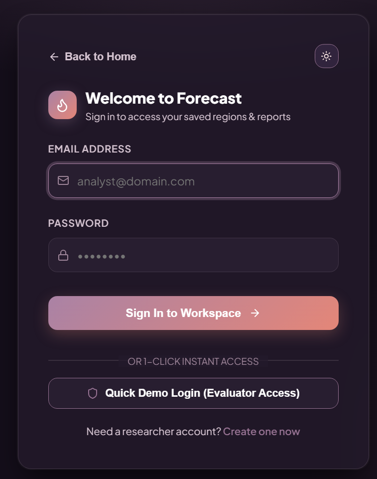 | 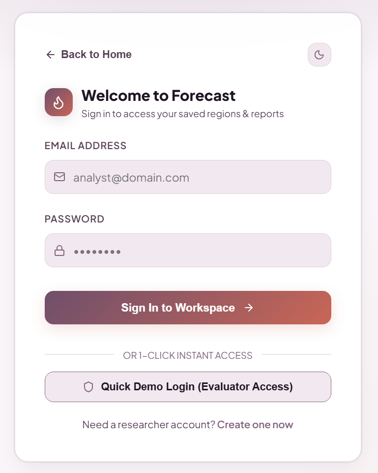 |

### Dashboard: heatwave analysis, Phoenix, AZ

**Dark theme**

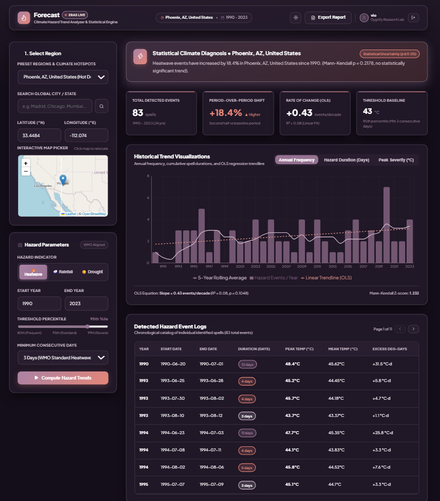

**Light theme**

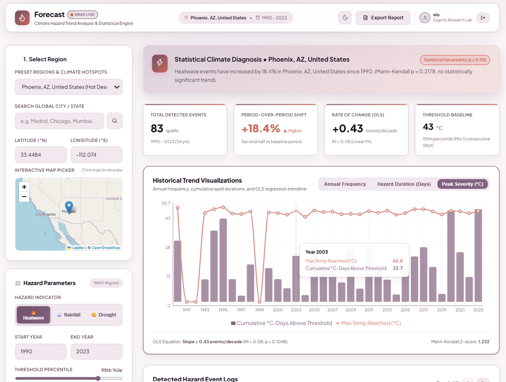

### Interactive trend visualizations

**Annual Frequency**: bars, 5-year rolling average and OLS trendline

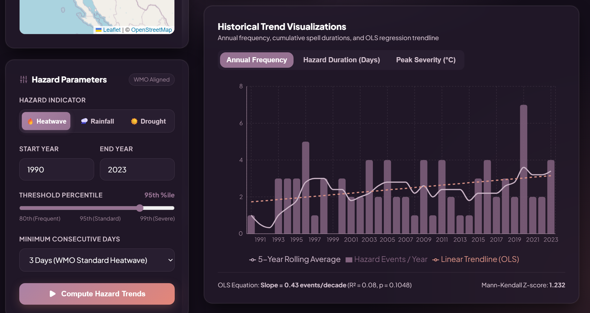

**Hazard Duration**: total days under hazard and average spell length

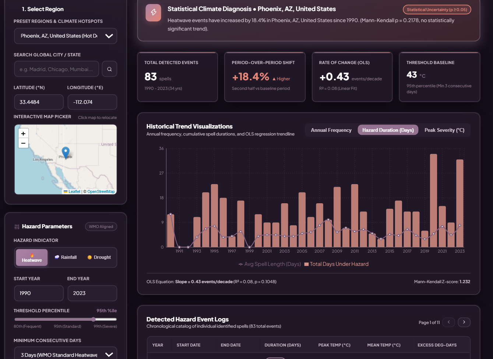

**Peak Severity**: cumulative °C-days above threshold and max temperature reached

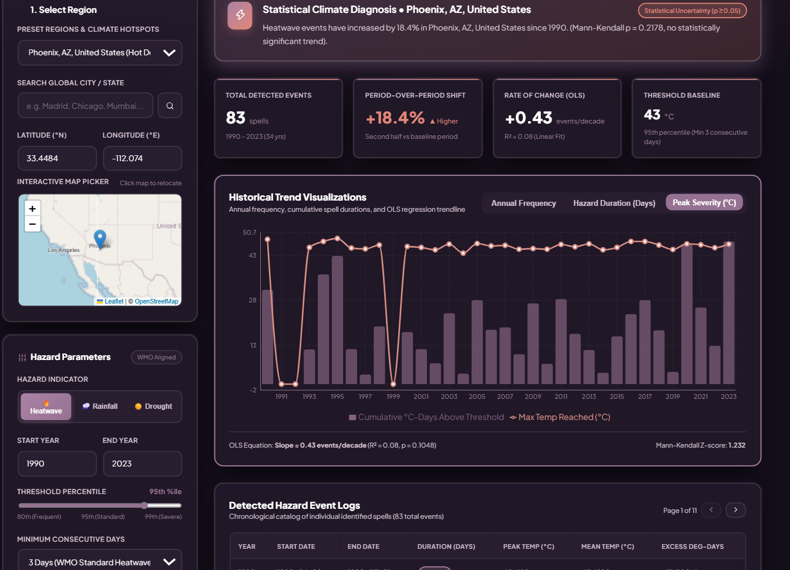

### Honest insight: Rainfall in Seville, Spain

Only 2 events were detected. The headline says "+100%", but the engine flags **Statistical Uncertainty (p ≥ 0.05)** and the card shows R² = 0.032, so the user is not misled by a tiny sample.

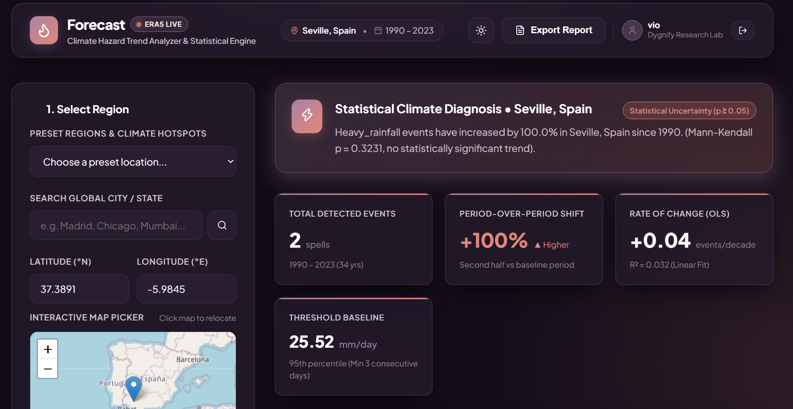

### Export (bonus)

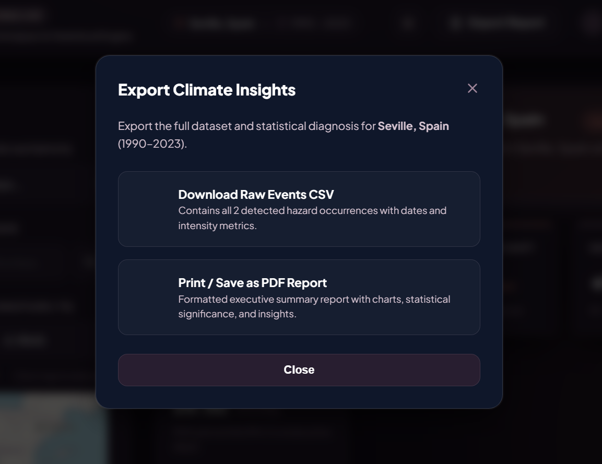

---

## 🧭 Design-First Approach

I designed the system on paper **before** writing UI code, working top-down and building the statistical engine before the interface:

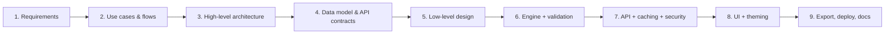
```mermaid
flowchart LR
    A[1. Requirements] --> B[2. Use cases & flows]
    B --> C[3. High-level architecture]
    C --> D[4. Data model & API contracts]
    D --> E[5. Low-level design]
    E --> F[6. Engine + validation]
    F --> G[7. API + caching + security]
    G --> H[8. UI + theming]
    H --> I[9. Export, deploy, docs]
```

1. **Requirements:** the user must be able to see whether a hazard is changing and how confident we are.
2. **Use cases:** pick place → choose hazard → tune → compute → interpret → export.
3. **Architecture:** separate presentation, API, analytics engine, cache/DB and external data so each can change independently.
4. **Contracts first:** `HazardEvent`, `TrendResult` and API payloads were defined before any screen.
5. **Engine before UI:** event detection and statistics were built and validated in isolation.
6. **Theming as design tokens:** dark and light are two palettes over the same components.

---

## 🏗 System Architecture

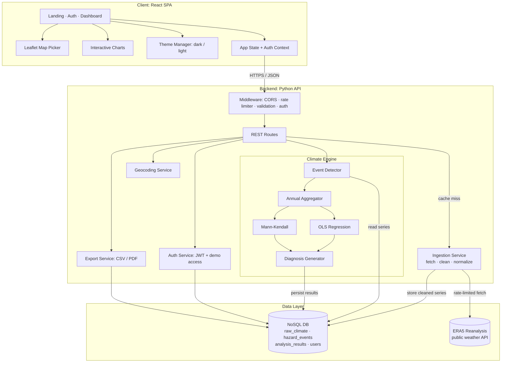
```mermaid
flowchart TB
    subgraph Client["Client: React SPA"]
        UI["Landing · Auth · Dashboard"]
        MAP["Leaflet Map Picker"]
        CHARTS["Interactive Charts"]
        THEME["Theme Manager: dark / light"]
        STATE["App State + Auth Context"]
    end

    subgraph Server["Backend: Python API"]
        MW["Middleware: CORS · rate limiter · validation · auth"]
        ROUTES["REST Routes"]
        AUTH["Auth Service: JWT + demo access"]
        GEO["Geocoding Service"]
        ING["Ingestion Service<br/>fetch · clean · normalize"]
        subgraph Engine["Climate Engine"]
            DET["Event Detector"]
            AGG["Annual Aggregator"]
            OLS["OLS Regression"]
            MK["Mann-Kendall"]
            DIAG["Diagnosis Generator"]
        end
        EXP["Export Service: CSV / PDF"]
    end

    subgraph Data["Data Layer"]
        NOSQL[("NoSQL DB<br/>raw_climate · hazard_events<br/>analysis_results · users")]
        EXT[("ERA5 Reanalysis<br/>public weather API")]
    end

    UI --> STATE
    UI --> MAP
    UI --> CHARTS
    UI --> THEME
    STATE -- "HTTPS / JSON" --> MW --> ROUTES
    ROUTES --> AUTH
    ROUTES --> GEO
    ROUTES --> EXP
    ROUTES --> DET
    ROUTES -- "cache miss" --> ING
    ING -- "rate-limited fetch" --> EXT
    ING -- "store cleaned series" --> NOSQL
    DET -- "read series" --> NOSQL
    DET --> AGG --> OLS
    AGG --> MK
    OLS --> DIAG
    MK --> DIAG
    DIAG -- "persist results" --> NOSQL
    AUTH --> NOSQL
    EXP --> NOSQL
```

**Key principle:** the API **reads from the database**. External data is fetched **once**, cleaned, cached in the NoSQL store, and every later request for the same grid cell/period is served from the DB.

| Layer | Responsibility |
|---|---|
| Presentation | Rendering, map interaction, charts, theming, form validation |
| API | Routing, auth, validation, rate limiting, response shaping |
| Ingestion | Safe external access, cleaning, unit normalization, caching |
| Climate engine | Pure, stateless statistics: detect → aggregate → test → explain |
| Data | Cached climate series, derived events/results, user data |

---

## 🔬 Low-Level Design

### 1. Request lifecycle: "Compute Hazard Trends"

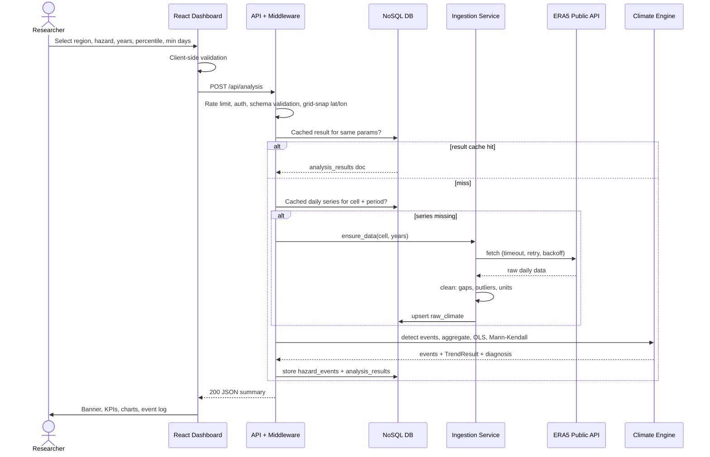
```mermaid
sequenceDiagram
    actor U as Researcher
    participant UI as React Dashboard
    participant API as API + Middleware
    participant DB as NoSQL DB
    participant ING as Ingestion Service
    participant EXT as ERA5 Public API
    participant ENG as Climate Engine

    U->>UI: Select region, hazard, years, percentile, min days
    UI->>UI: Client-side validation
    UI->>API: POST /api/analysis
    API->>API: Rate limit, auth, schema validation, grid-snap lat/lon
    API->>DB: Cached result for same params?
    alt result cache hit
        DB-->>API: analysis_results doc
    else miss
        API->>DB: Cached daily series for cell + period?
        alt series missing
            API->>ING: ensure_data(cell, years)
            ING->>EXT: fetch (timeout, retry, backoff)
            EXT-->>ING: raw daily data
            ING->>ING: clean: gaps, outliers, units
            ING->>DB: upsert raw_climate
        end
        API->>ENG: detect events, aggregate, OLS, Mann-Kendall
        ENG-->>API: events + TrendResult + diagnosis
        API->>DB: store hazard_events + analysis_results
    end
    API-->>UI: 200 JSON summary
    UI->>U: Banner, KPIs, charts, event log
```

### 2. Data cleaning pipeline

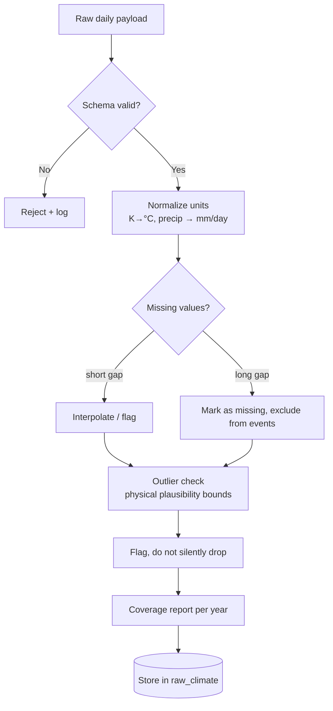
```mermaid
flowchart TD
    RAW[Raw daily payload] --> SCHEMA{Schema valid?}
    SCHEMA -- No --> ERR[Reject + log]
    SCHEMA -- Yes --> UNITS["Normalize units<br/>K→°C, precip → mm/day"]
    UNITS --> NULLS{Missing values?}
    NULLS -- "short gap" --> INTERP[Interpolate / flag]
    NULLS -- "long gap" --> MARK[Mark as missing, exclude from events]
    INTERP --> OUTL
    MARK --> OUTL
    OUTL["Outlier check<br/>physical plausibility bounds"] --> FLAG[Flag, do not silently drop]
    FLAG --> COV["Coverage report per year"]
    COV --> STORE[(Store in raw_climate)]
```

### 3. Event detection (per hazard)

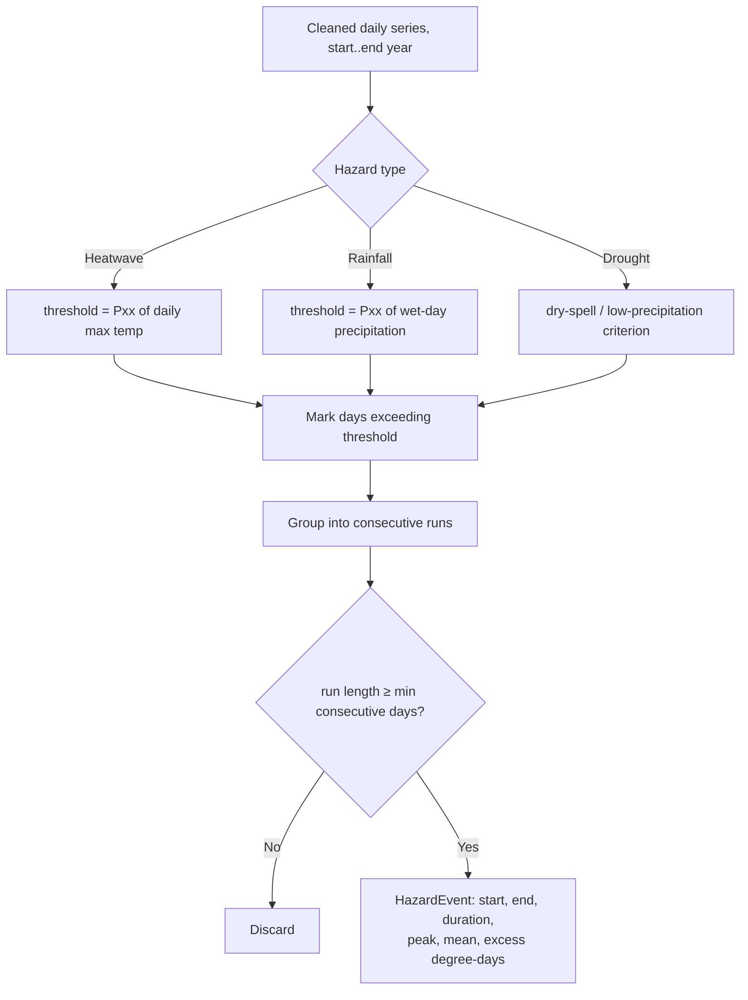
```mermaid
flowchart TD
    S[Cleaned daily series, start..end year] --> T{Hazard type}
    T -- Heatwave --> H["threshold = Pxx of daily max temp"]
    T -- Rainfall --> R["threshold = Pxx of wet-day precipitation"]
    T -- Drought --> D["dry-spell / low-precipitation criterion"]
    H --> M[Mark days exceeding threshold]
    R --> M
    D --> M
    M --> C[Group into consecutive runs]
    C --> F{"run length ≥ min consecutive days?"}
    F -- No --> X[Discard]
    F -- Yes --> E["HazardEvent: start, end, duration,<br/>peak, mean, excess degree-days"]
```

### 4. Statistical pipeline

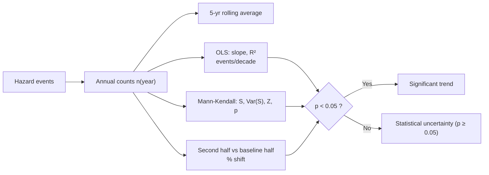
```mermaid
flowchart LR
    EV[Hazard events] --> AN["Annual counts n(year)"]
    AN --> RA[5-yr rolling average]
    AN --> OLS["OLS: slope, R²<br/>events/decade"]
    AN --> MKT["Mann-Kendall: S, Var(S), Z, p"]
    AN --> SH["Second half vs baseline half<br/>% shift"]
    OLS --> V
    MKT --> V
    SH --> V
    V{"p < 0.05 ?"} -- Yes --> SIG[Significant trend]
    V -- No --> UNC["Statistical uncertainty (p ≥ 0.05)"]
```

### 5. Frontend component tree

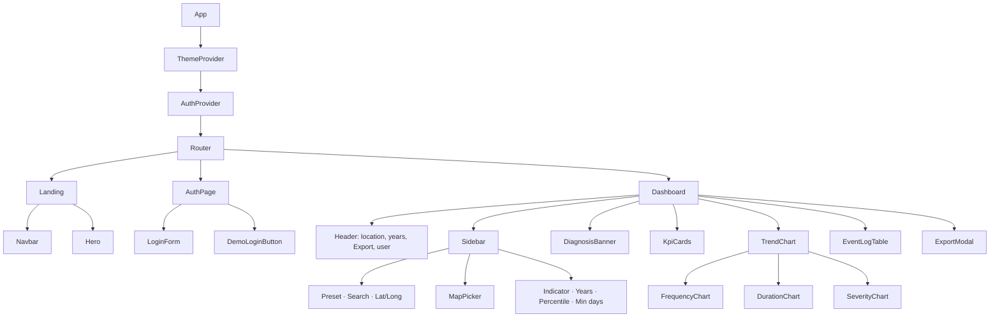
```mermaid
flowchart TD
    App --> ThemeProvider --> AuthProvider --> Router
    Router --> Landing
    Router --> AuthPage
    Router --> Dashboard
    Landing --> Navbar
    Landing --> Hero
    AuthPage --> LoginForm
    AuthPage --> DemoLoginButton
    Dashboard --> Header["Header: location, years, Export, user"]
    Dashboard --> Sidebar
    Sidebar --> RegionSelector["Preset · Search · Lat/Long"]
    Sidebar --> MapPicker
    Sidebar --> HazardParams["Indicator · Years · Percentile · Min days"]
    Dashboard --> DiagnosisBanner
    Dashboard --> KpiCards
    Dashboard --> TrendChart
    TrendChart --> FrequencyChart
    TrendChart --> DurationChart
    TrendChart --> SeverityChart
    Dashboard --> EventLogTable
    Dashboard --> ExportModal
```

### 6. NoSQL document model

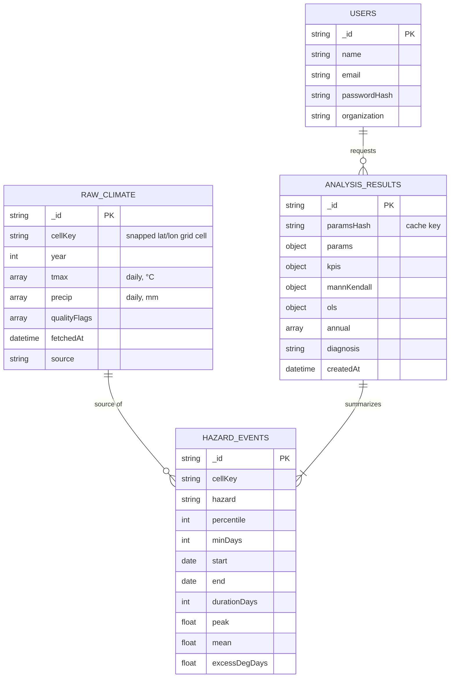
```mermaid
erDiagram
    USERS ||--o{ ANALYSIS_RESULTS : requests
    RAW_CLIMATE ||--o{ HAZARD_EVENTS : "source of"
    ANALYSIS_RESULTS ||--|{ HAZARD_EVENTS : summarizes

    USERS {
        string _id PK
        string name
        string email
        string passwordHash
        string organization
    }
    RAW_CLIMATE {
        string _id PK
        string cellKey "snapped lat/lon grid cell"
        int year
        array tmax "daily, °C"
        array precip "daily, mm"
        array qualityFlags
        datetime fetchedAt
        string source
    }
    HAZARD_EVENTS {
        string _id PK
        string cellKey
        string hazard
        int percentile
        int minDays
        date start
        date end
        int durationDays
        float peak
        float mean
        float excessDegDays
    }
    ANALYSIS_RESULTS {
        string _id PK
        string paramsHash "cache key"
        object params
        object kpis
        object mannKendall
        object ols
        array annual
        string diagnosis
        datetime createdAt
    }
```

---

## 📐 UML Diagrams

### Class diagram

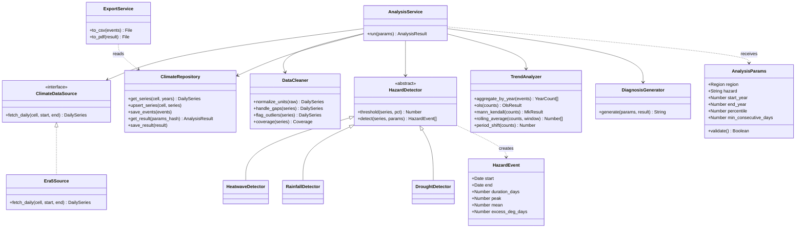
```mermaid
classDiagram
    class ClimateDataSource {
        <<interface>>
        +fetch_daily(cell, start, end) DailySeries
    }
    class Era5Source {
        +fetch_daily(cell, start, end) DailySeries
    }
    class DataCleaner {
        +normalize_units(raw) DailySeries
        +handle_gaps(series) DailySeries
        +flag_outliers(series) DailySeries
        +coverage(series) Coverage
    }
    class ClimateRepository {
        +get_series(cell, years) DailySeries
        +upsert_series(cell, series)
        +save_events(events)
        +get_result(params_hash) AnalysisResult
        +save_result(result)
    }
    class HazardDetector {
        <<abstract>>
        +threshold(series, pct) Number
        +detect(series, params) HazardEvent[]
    }
    class HeatwaveDetector
    class RainfallDetector
    class DroughtDetector
    class HazardEvent {
        +Date start
        +Date end
        +Number duration_days
        +Number peak
        +Number mean
        +Number excess_deg_days
    }
    class TrendAnalyzer {
        +aggregate_by_year(events) YearCount[]
        +ols(counts) OlsResult
        +mann_kendall(counts) MkResult
        +rolling_average(counts, window) Number[]
        +period_shift(counts) Number
    }
    class DiagnosisGenerator {
        +generate(params, result) String
    }
    class AnalysisService {
        +run(params) AnalysisResult
    }
    class ExportService {
        +to_csv(events) File
        +to_pdf(result) File
    }
    class AnalysisParams {
        +Region region
        +String hazard
        +Number start_year
        +Number end_year
        +Number percentile
        +Number min_consecutive_days
        +validate() Boolean
    }

    ClimateDataSource <|.. Era5Source
    HazardDetector <|-- HeatwaveDetector
    HazardDetector <|-- RainfallDetector
    HazardDetector <|-- DroughtDetector
    AnalysisService --> ClimateDataSource
    AnalysisService --> DataCleaner
    AnalysisService --> ClimateRepository
    AnalysisService --> HazardDetector
    AnalysisService --> TrendAnalyzer
    AnalysisService --> DiagnosisGenerator
    HazardDetector ..> HazardEvent : creates
    AnalysisService ..> AnalysisParams : receives
    ExportService ..> ClimateRepository : reads
```

### Use-case diagram

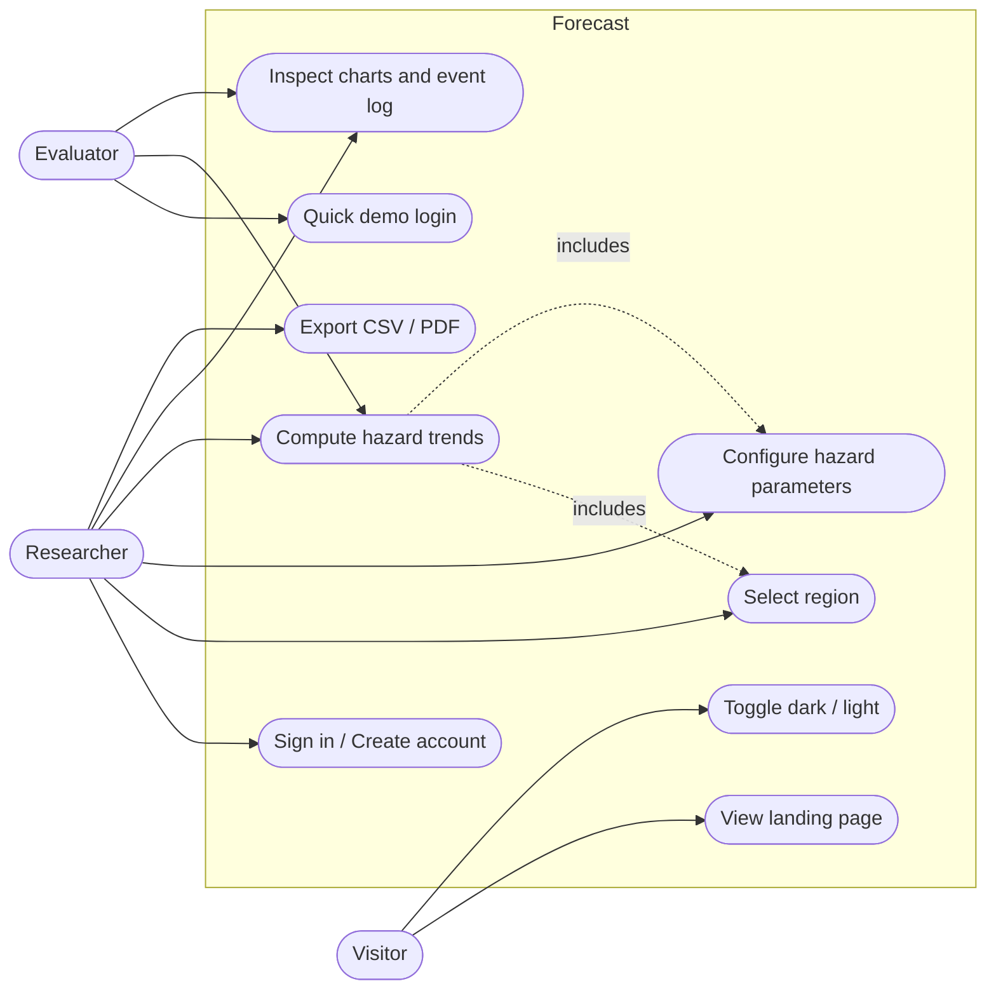
```mermaid
flowchart LR
    V(["Visitor"])
    R(["Researcher"])
    E(["Evaluator"])
    subgraph System["Forecast"]
        UC1([View landing page])
        UC2([Toggle dark / light])
        UC3([Quick demo login])
        UC4([Sign in / Create account])
        UC5([Select region])
        UC6([Configure hazard parameters])
        UC7([Compute hazard trends])
        UC8([Inspect charts and event log])
        UC9([Export CSV / PDF])
    end
    V --> UC1
    V --> UC2
    E --> UC3
    R --> UC4
    R --> UC5
    R --> UC6
    R --> UC7
    R --> UC8
    R --> UC9
    E --> UC7
    E --> UC8
    UC7 -. includes .-> UC5
    UC7 -. includes .-> UC6
```

### State diagram: dashboard

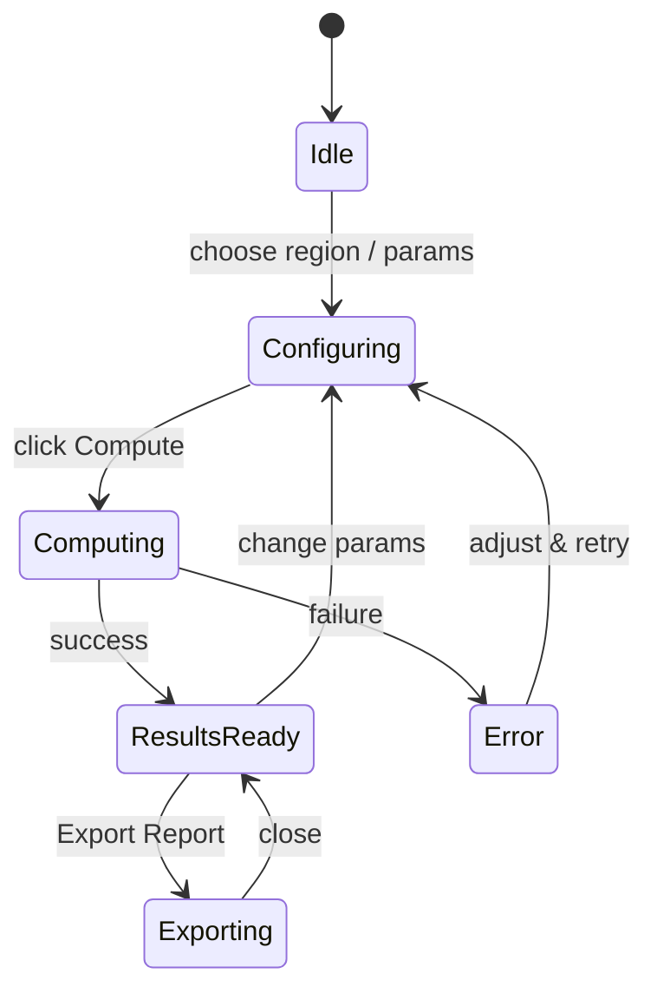
```mermaid
stateDiagram-v2
    [*] --> Idle
    Idle --> Configuring : choose region / params
    Configuring --> Computing : click Compute
    Computing --> ResultsReady : success
    Computing --> Error : failure
    Error --> Configuring : adjust & retry
    ResultsReady --> Configuring : change params
    ResultsReady --> Exporting : Export Report
    Exporting --> ResultsReady : close
```

---

## 🗃 Data Sources & Data Handling

**Source:** ERA5 reanalysis (Copernicus / ECMWF), daily temperature and precipitation from 1950 to present, accessed through a public API (no personal credentials stored in the repo).

Real-world climate data is noisy, so the ingestion layer handles:

| Problem | How it is handled |
|---|---|
| **Gaps / missing values** | Short gaps are interpolated and flagged; long gaps are marked missing and excluded from event detection (never silently counted as "no hazard") |
| **Outliers** | Checked against physical plausibility bounds; flagged rather than silently dropped |
| **Units** | Normalized on ingest (Kelvin → °C, precipitation → mm/day) so downstream logic is unit-safe |
| **Grid mismatch** | User lat/lon is snapped to the reanalysis grid cell so nearby requests share cache entries |
| **Repeated requests** | Cleaned series are cached in the NoSQL DB; derived results are cached by a hash of the parameters |
| **External API failures** | Timeouts, retries with exponential backoff, and graceful error responses |
| **Data coverage** | A per-year coverage report is stored so thin or incomplete data can be flagged to the user |

---

## 🌡 Hazard Detection Logic

### Heatwave (default hazard)

A heatwave is a spell of **N or more consecutive days** (default **N = 3**) on which daily **maximum temperature exceeds the 95th percentile** of the region's temperature record.

1. Compute the threshold: the Pth percentile (default **95th**) of daily maximum temperature for the selected region/period. This is shown on the dashboard as **Threshold Baseline**.
2. Flag every day above the threshold.
3. Group flagged days into consecutive runs.
4. Keep runs of at least `min_consecutive_days`.
5. For each event, record start, end, duration, **peak temperature**, **mean temperature** and **excess degree-days** (cumulative °C above threshold).

Percentile and consecutive-day length are user-tunable (80th = frequent, 95th = standard, 99th = severe).

### Rainfall and Drought

- **Rainfall:** heavy-precipitation spells above a percentile of wet-day precipitation.
- **Drought:** prolonged dry/low-precipitation spells.

Heatwave is the primary, most thoroughly developed hazard; Rainfall and Drought reuse the same detection → aggregation → statistics pipeline.

---

## 📈 Trend Analysis & Honest Insights

| Method | Purpose |
|---|---|
| **Annual aggregation** | Events per year, total hazard days, average spell length, peak severity |
| **5-year rolling average** | Smooths year-to-year variability |
| **OLS regression** | Slope in *events/decade* and R² for the linear trend line |
| **Mann-Kendall test (bonus)** | Non-parametric monotonic trend test, robust to non-normal data and outliers; reports Z-score and p-value |
| **Period-over-period shift** | % change of the second half versus the baseline half |
| **Significance rule** | `p < 0.05` → significant; otherwise displayed as **Statistical Uncertainty** |

**Why this matters (critical thinking):**

- **Phoenix, AZ:** heatwave events are up **+18.4%**, but Mann-Kendall `p = 0.2178`, so the app says *"no statistically significant trend"* instead of declaring a crisis.
- **Seville, Spain (rainfall):** a "+100%" shift comes from going from 1 to 2 events. The app surfaces the tiny sample (2 spells), a low R² (0.032) and p = 0.3231, so the headline number is clearly caveated.
- Headline percentages are **always paired** with a significance statement; the app never reports a trend as fact without its confidence.

---

## 🔒 Security & Performance

| Concern | Implementation |
|---|---|
| **Input validation** | Strict schema validation: lat ∈ [-90, 90], lon ∈ [-180, 180], year range bounds, percentile and min-day limits, hazard enum |
| **Rate limiting** | Per-IP / per-user limits on analysis, geocoding and auth endpoints |
| **Safe external access** | Allow-listed upstream hosts, timeouts, retries with backoff, no user-supplied URLs (SSRF-safe) |
| **Auth** | Password hashing, JWT sessions, protected routes; evaluator demo login with limited scope |
| **CORS & headers** | Restricted origins, security headers |
| **Secrets** | Environment variables only, never committed |
| **Caching (3 layers)** | Cleaned series in DB → derived results by params hash → HTTP caching of static assets |
| **Efficient processing** | Vectorized array operations for percentiles/runs; compute once, read many |
| **Pagination** | Event log is paginated server- or client-side to keep payloads light |

---

## 🧰 Tech Stack

> Update any row that differs from your final implementation.

| Layer | Technology |
|---|---|
| Frontend | React, Tailwind CSS (design tokens for dark/light), Leaflet + OpenStreetMap |
| Charts | Interactive bar + line combo charts with tooltips |
| Backend | Python REST API (FastAPI/Flask) |
| Analytics | NumPy / SciPy-style processing: percentiles, OLS, Mann-Kendall |
| Database | MongoDB (NoSQL) |
| Data | ERA5 reanalysis via public weather API |
| Export | CSV generation + print-to-PDF report |
| Deployment | Frontend and backend on free-tier hosting |

---

## 🚀 Setup Instructions

### Prerequisites
- Node.js ≥ 18
- Python ≥ 3.10
- A running MongoDB instance (local or Atlas free tier)

### 1. Clone
```bash
git clone <your-repo-url>
cd forecast
```

### 2. Backend
```bash
cd server
python -m venv .venv
source .venv/bin/activate        # Windows: .venv\Scripts\activate
pip install -r requirements.txt
cp .env.example .env             # fill in values below
uvicorn app.main:app --reload --port 8000   # adjust to your entrypoint
```

**`server/.env`**
```env
MONGODB_URI=mongodb://localhost:27017/forecast
JWT_SECRET=change-me
CORS_ORIGINS=http://localhost:5173
RATE_LIMIT_PER_MINUTE=60
CACHE_TTL_DAYS=30
```

### 3. Frontend
```bash
cd client
npm install
cp .env.example .env
npm run dev
```

**`client/.env`**
```env
VITE_API_URL=http://localhost:8000
```

### 4. Try it
Open `http://localhost:5173` → **Launch App** → **Quick Demo Login (Evaluator Access)** → pick a preset (e.g. *Phoenix, AZ*) → **Compute Hazard Trends**.

---

## 🔌 API Reference

> Illustrative contract. Align with your real routes.

| Method | Endpoint | Description |
|---|---|---|
| `POST` | `/api/auth/login` | Email + password → JWT |
| `POST` | `/api/auth/register` | Create researcher account |
| `POST` | `/api/auth/demo` | Evaluator demo login |
| `GET` | `/api/geocode?q=Madrid` | City/state search → lat/lon |
| `POST` | `/api/analysis` | Run hazard analysis (reads cached data, computes, stores) |
| `GET` | `/api/analysis/{id}/events?page=1` | Paginated event log |
| `GET` | `/api/analysis/{id}/export?format=csv` | Download events CSV |

**Request**
```json
{
  "lat": 33.4484,
  "lon": -112.074,
  "hazard": "heatwave",
  "startYear": 1990,
  "endYear": 2023,
  "percentile": 95,
  "minConsecutiveDays": 3
}
```

**Response (abridged)**
```json
{
  "diagnosis": "Heatwave events have increased by 18.4% in Phoenix, AZ since 1990. (Mann-Kendall p = 0.2178, no statistically significant trend).",
  "kpis": { "totalEvents": 83, "periodShiftPct": 18.4, "olsSlope": 0.43, "r2": 0.08, "baseline": 43 },
  "mannKendall": { "z": 1.232, "p": 0.2178, "significant": false },
  "annual": [{ "year": 1990, "count": 1, "totalDays": 12, "peak": 48.4 }],
  "events": [{ "start": "1990-06-20", "end": "1990-07-01", "durationDays": 12, "peak": 48.4, "mean": 45.62, "excessDegDays": 31.5 }]
}
```

---

## 🗂 Project Structure

```
forecast/
├── docs/
│   └── screenshots/            # images used in this README
├── client/
│   └── src/
│       ├── components/         # Header, Sidebar, MapPicker, KpiCards, charts, EventLog, ExportModal
│       ├── pages/              # Landing, Auth, Dashboard
│       ├── context/            # ThemeContext, AuthContext
│       └── styles/             # dark / light design tokens
├── server/
│   └── app/
│       ├── routes/             # auth, geocode, analysis, export
│       ├── services/           # analysis, ingestion, export, geocode
│       ├── engine/             # detectors, trend analyzer, mann_kendall, ols, diagnosis
│       ├── data/               # ERA5 source adapter, cleaner, repository
│       └── core/               # config, security, rate limiting
└── README.md
```

---

## 📝 Assumptions

- **Heatwave is the primary hazard** and default; Rainfall and Drought share the same pipeline with simpler definitions.
- The **95th percentile threshold** is computed over the selected region and period, and is user-adjustable.
- **ERA5 reanalysis** is treated as ground truth at its native grid resolution; local station values may differ.
- The default minimum spell length is **3 consecutive days** (WMO-style).
- A **significance level of 0.05** is used for Mann-Kendall.
- Event counts per year are treated as the series for trend testing.
- Coordinates are snapped to the reanalysis grid to improve cache reuse.
- The evaluator demo account has limited scope and is for review purposes only.

---

## ⚠️ Known Limitations

- A single global percentile threshold ignores seasonality; a **calendar-day-window percentile** is more standard in climatology.
- Using the analysis period itself as the baseline means the threshold shifts when the user changes the range.
- Years with **zero events** are drawn as dips in the Peak Severity line chart (e.g. 1991–1993, 1999 in Phoenix), which can be misread as a very low temperature rather than "no event".
- Percentage shifts on **very small samples** (e.g. 1 → 2 events) are mathematically correct but not meaningful; this is mitigated with significance and sample-size context.
- Mann-Kendall on event counts does not account for serial correlation.
- Reanalysis data is gridded and may smooth local extremes (urban heat, microclimates).

---

## 🔭 What I Would Improve With More Time

- Calendar-day-window percentiles with a **fixed reference baseline** (e.g. 1961–1990) and seasonal handling.
- **Sen's slope** and **pre-whitening / modified Mann-Kendall** for autocorrelated data.
- Station-data cross-validation (NOAA NCEI) against ERA5.
- Multi-region comparison view and custom lat-lon **bounding-box** aggregation.
- Background job queue for large ingestions and **cache warming** of popular regions.
- Server-side **PDF generation** with embedded charts.
- Automated test suite for the engine (known-answer fixtures) and CI.
- Observability: structured logs, metrics, uptime alerts.
- Additional hazards (cold waves, flood indices) and CMIP6 projection overlays.

---

## 🤖 AI Tools Used

I used AI tools as assistants, not as a replacement for understanding the code.

| Tool | How it was used |
|---|---|
| **Google Gemini** | Help with the codebase, mainly the **backend**: debugging, explaining approaches and getting unstuck on the harder modules listed below |
| **Claude** | Drafting this README, the architecture / UML / low-level design diagrams, and structuring the documentation |

### Where I needed the most help (hardest files)

| File / module | What was difficult |
|---|---|
| `server/app/engine/mann_kendall.py` | Implementing the Mann-Kendall S statistic, variance (with tie correction) and Z-score / p-value, and checking it against a known result |
| `server/app/engine/` event detector (heatwave) | Percentile threshold plus grouping flagged days into consecutive runs, and computing duration, peak, mean and excess degree-days correctly |
| `server/app/data/cleaner.py` | Handling gaps, outliers and unit conversion (Kelvin → °C, precipitation units) in noisy real-world data |
| `server/app/services/ingestion.py` | Safe external API access: timeouts, retries with backoff, grid-cell snapping and cache-on-first-fetch |
| `server/app/data/repository.py` | MongoDB caching design: storing raw series and results, and cache keys based on a hash of the parameters |
| `server/app/core/` rate limiting and validation | Rate-limiting middleware and strict validation of user-supplied inputs (lat/lon, year range, percentile) |

### What I did myself

System design (architecture, data model and API contracts), the choice of hazard definitions and statistical methods, frontend UI and theming, integration, and testing and review of all AI-assisted code. I can walk through and modify any part of the codebase live.

---

<div align="center">

Built for the **Climate Hazard Trend Analyzer** case study · Dygnify Ventures Pvt Ltd

</div>
